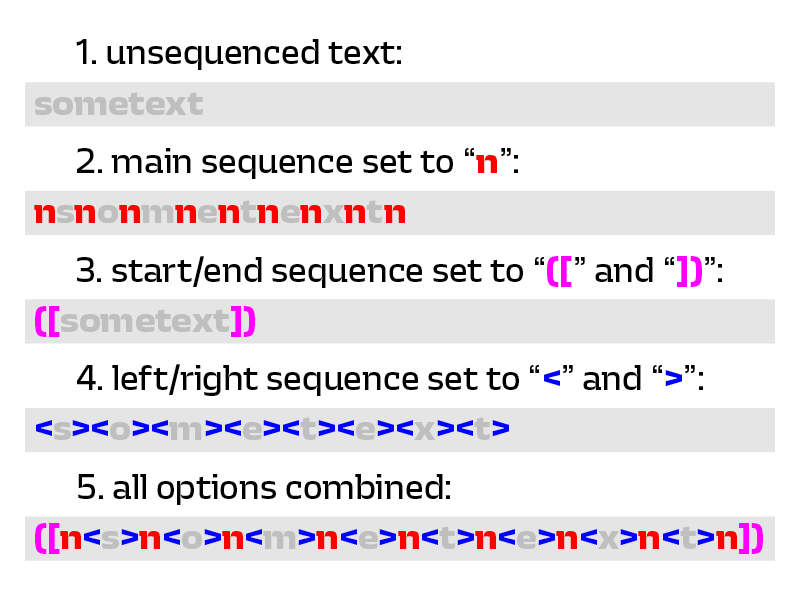

# Text Sequencer

A plugin that helps in generating spacing/kerning sequence strings in the glyph edit window.

Simple, yet practical!

Its UI is divided into three sections:

- `Main Sequence` input: Text from here will be placed between every letter in the sequence. There is no need to manually add spacing "n" strings. Instead, simply use "n" in the main sequence.
- `Start/end` inputs: Text from here will be put on the very beginning or end of the whole sequence.
- `Left/right` inputs: Text from here will be put on the left and/or right side of each character in the sequence.

Press the `Insert` button to insert the selected sequence of letters. If you have highlighted only a part of the text in the Text Edit mode, the sequence will be applied to the selected fragment only. If you haven't highlighted anything, it will treat whole text in current tab as a starting point for the sequence.

